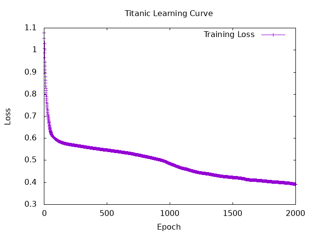

# Evaluation + AdmissionChances

<br>

## Launch the program
```bash
docker compose exec hasktorch /bin/bash -c "cd /home/ubuntu/internship-bekkilab-japan-2025/ && stack run session5-admission"
```


<br>

## Learning Curve 

| **Hyperparameter** | **Value**         |
|---------------------|-------------------|
| BatchSize          | ```16```                |
| LearningRate       | ```0.0001```            |
| Epochs             | ```30 ```               |
| Optimizer          | ```Adam(0, 0.9, 0.999)``` |
| MLPSpec          |```7 16 16 1``` |

<br>


<br>
<br>

## Output 

```
Epoch 10 | Train Loss: 8.564599e-3 | Valid Loss: 2.3019142e-2
Epoch 20 | Train Loss: 8.264563e-3 | Valid Loss: 2.2487981e-2
Epoch 30 | Train Loss: 8.015199e-3 | Valid Loss: 2.2031775e-2

Final Eval Loss: 3.6114648e-2

Final Accuracy: 0.84375

               Expected
           Not admit     admit
 Not admit         0         5
     admit         0        27

Final Precision: 0.84375
Final Recall: 1.0
Final F1 Score: 0.91525424
```
<br>

## Result
| **metrics** | **Average**         | **Variance**         |
|---------------------|-------------------|-------------------|
|  Eval Loss        | ```32```                | ```32```                |
|  Accuracy       | ```0.0001 ```           | ```32```                |
|  Precision             | ```3000```                | ```32```                |
| Recall         | ```Adam(10 0.9 0.999)``` | ```32```                |
| F1 Score          |```7 16 16 1``` | ```32```                |


<br>
<br>


# Titanic 
<br>

## Launch the program

```bash
docker compose exec hasktorch /bin/bash -c "cd /home/ubuntu/internship-bekkilab-japan-2025/ && stack run session5-titanic"
```

## Learning Curve 

| **Hyperparameter** | **Value**         |
|---------------------|-------------------|
| BatchSize          | ```32```                |
| LearningRate       | ```0.0001 ```           |
| Epochs             | ```3000```                |
| Optimizer          | ```Adam(10 0.9 0.999)``` |
| MLPSpec          |```7 16 16 1``` |

<br>



<br>

## Output

```bash
Epoch 1000 | Train Loss: 0.2994231
Epoch 2000 | Train Loss: 0.27554816

Final Accuracy: 0.7997685

                Expected
                 Die   Survive
       Die       451        81
   Survive        92       240

Final Precision: 0.74766356

Final Recall: 0.72289157

Final F1 Score: 0.7350689
```

# CIFER MLP

## Launch the program

```bash
docker compose exec hasktorch /bin/bash -c "cd /home/ubuntu/internship-bekkilab-japan-2025/ && stack run session5-cifer-mlp"
```


