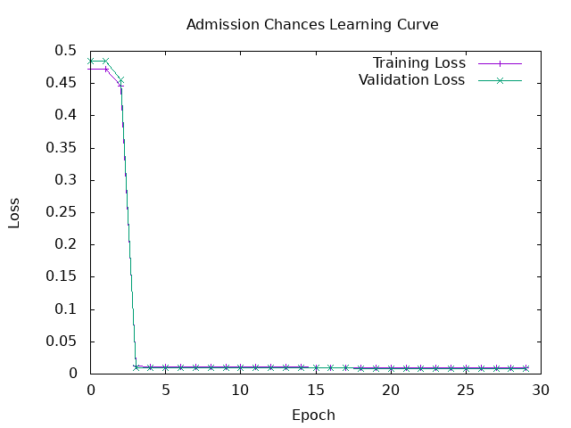

# Evaluation + AdmissionChances


## Launch the program
```bash
docker compose exec hasktorch /bin/bash -c "cd /home/ubuntu/internship-bekkilab-japan-2025/ && stack run session5-admission"
```


## Learning Curve 

| **Hyperparameter** | **Value**         |
|---------------------|-------------------|
| BatchSize          | ```16```                |
| LearningRate       | ```0.0001```            |
| Epochs             | ```30 ```               |
| Optimizer          | ```Adam(0, 0.9, 0.999)``` |
| MLPSpec          |```7 16 16 1``` |

<br>



## Output 

```
Epoch 10 | Train Loss: 8.564599e-3 | Valid Loss: 2.3019142e-2
Epoch 20 | Train Loss: 8.264563e-3 | Valid Loss: 2.2487981e-2
Epoch 30 | Train Loss: 8.015199e-3 | Valid Loss: 2.2031775e-2

Final Eval Loss: 3.6114648e-2

Final Accuracy: 0.84375

               Expected
           Not admit     admit
 Not admit         0         5
     admit         0        27

Final Precision: 0.84375
Final Recall: 1.0
Final F1 Score: 0.91525424
```


# Titanic 

## Launch the program

```bash
docker compose exec hasktorch /bin/bash -c "cd /home/ubuntu/internship-bekkilab-japan-2025/ && stack run session5-titanic"
```

## Learning Curve 

| **Hyperparameter** | **Value**         |
|---------------------|-------------------|
| BatchSize          | ```32```                |
| LearningRate       | ```0.0001 ```           |
| Epochs             | ```3000```                |
| Optimizer          | ```Adam(10 0.9 0.999)``` |
| MLPSpec          |```7 8 8 1``` |

<br>


