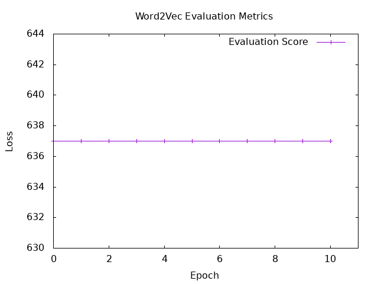
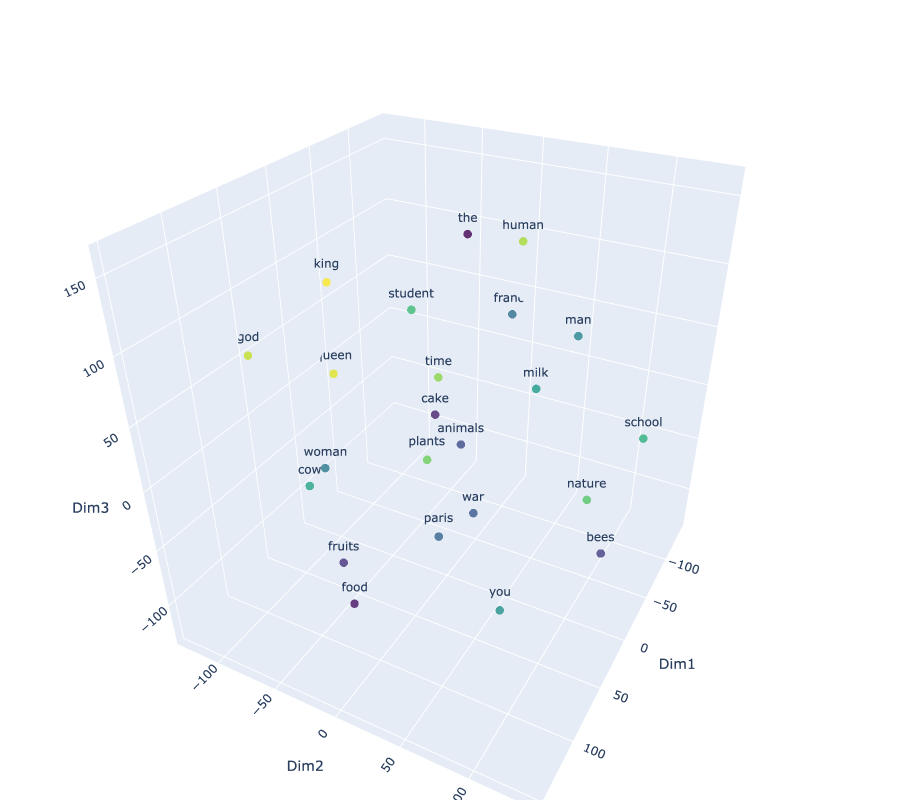

# Word2Vec (Skip Gram method)

## Laucnh the program

### Create the vocab
```bash
docker compose exec hasktorch /bin/bash -c "cd /home/ubuntu/internship-bekkilab-japan-2025/ && stack run session6-create-vocab"
```

### Train the model
```bash
docker compose exec hasktorch /bin/bash -c "cd /home/ubuntu/internship-bekkilab-japan-2025/ && stack run session6-word2vec"
```

### Eval the model
```bash
docker compose exec hasktorch /bin/bash -c "cd /home/ubuntu/internship-bekkilab-japan-2025/ && stack run session6-eval-word2vec"
```

## Training

| **Hyperparameter** | **Value**         |
|---------------------|-------------------|
| BatchSize          | ```128```                |
| LearningRate       | ```0.005```            |
| NbBatch trained            | ``` ~1000  ```               |
| Optimizer          | ```GD``` |
| MLPSpec          |```embdDim embdDim*2 embdDim*2 VocabSize``` |
|    VocabSize       | ``` 30 000```                |
|    seqLen       | ```128 ```                |
|        emdbDim   | ``` 128```                |
|       windowSize    | ```2 ```                |
|       nbLine of text   | ```~40000 ```                |
|       Loss Func   | ``` CrossEntropy ```                |

<br>

### Training curve

<br>


## Results

### Semantic Textual Similarity (STS) 
Some problems with the STS evaluation because cosine similarity is always very closest to 1 so the predicted discretize score is always 5. 


```bash
ScoreLabel: 3, Difference: 2, Cosine Similarity: 0.999001, Discretized Score: 5

ScoreLabel: 3, Difference: 2, Cosine Similarity: 0.9869428, Discretized Score: 5

ScoreLabel: 0, Difference: 5, Cosine Similarity: 0.97843164, Discretized Score: 5

ScoreLabel: 0, Difference: 5, Cosine Similarity: 0.98549336, Discretized Score: 5

ScoreLabel: 2, Difference: 3, Cosine Similarity: 0.97819227, Discretized Score: 5

ScoreLabel: 0, Difference: 5, Cosine Similarity: 0.98996466, Discretized Score: 5
...

Total Score : 637
```
<br>
<br>

### Eval Curve (Sum of differences between ScoreLabel and Discretized Predicted Score)


<br>
<br>

### 3D Projection with TSNE (T-distributed Stochastic Neighbor Embedding)
The best way to find some similarities and links in this embedding is to look at the colors

<br>



