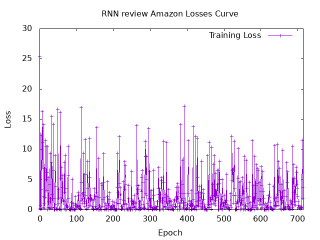

# Laucnh the program

```bash
docker compose exec hasktorch /bin/bash -c "cd /home/ubuntu/internship-bekkilab-japan-2025/ && stack run session7-amazon-review"
```


# Code 

### hasktorch-tools implementation

```hs
data Model = Model {
  emb :: Embedding,
  rnn :: RnnParams,
  initialStates :: InitialStatesParams,
  mlp :: MLP
} deriving (Show, Generic, Parameterized)
```

```hs
forwardModel :: Model -> Tensor -> (Tensor, Tensor,Tensor)
forwardModel Model{..} inputIds =
  let 
      embeddings = embedding' (toDependent $ wordEmbedding emb) inputIds
      
      (output, hiddenStates) = rnnLayers rnn Tanh Nothing (toDependent $ h0s initialStates) embeddings

      logits = mlpForward mlp output
      
  in (output, hiddenStates , logits)
```
# Training

| **Hyperparameter** | **Value**         |
|---------------------|-------------------|
| BatchSize          | ```32```                |
| LearningRate       | ```0.01```            |
| Optimizer          | ```GD``` |
|    VocabSize       | ``` 30 000```                |
|    seqLen       | ```128 ```                |
|        emdbDim   | ``` 128```                |
|        hiddenDim   | ``` 128```                |
|        nLayer   | ``` 2```                |
|       Loss Func   | ``` MSE ```                |


